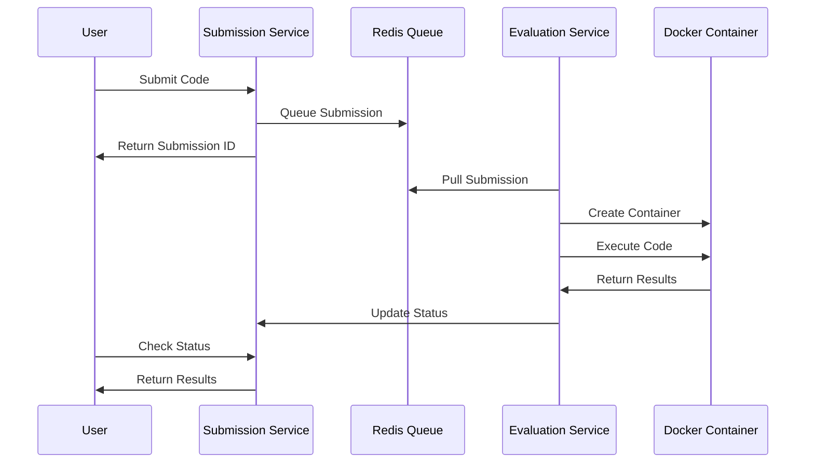

# 🚀 CodeJudge - LeetCode Clone

> A production-ready, full-stack coding platform that enables users to solve algorithmic problems with real-time code evaluation across multiple programming languages.

[](https://nodejs.org/)
[](https://www.typescriptlang.org/)
[](https://www.docker.com/)
[](https://redis.io/)
[](https://www.mongodb.com/)

## 📋 Table of Contents

- [Overview](#-overview)
- [System Architecture](#-system-architecture)
- [Features](#-features)
- [Tech Stack](#-tech-stack)
- [API Documentation](#-api-documentation)

## 🌟 Overview

Leetcode is a scalable, microservices-based coding platform backend. It features secure code execution in isolated Docker containers, real-time evaluation, and comprehensive problem management capabilities.

### Key Highlights

- **🔐 Secure Execution**: Code runs in isolated Docker containers with resource limits
- **⚡ Real-time Processing**: Asynchronous evaluation using Redis queues
- **🎯 Multi-language Support**: Python and C++ with optimized timeouts
- **📊 Comprehensive Results**: Detailed test case evaluation with standard judge responses
- **🏗️ Scalable Architecture**: Clean microservices design for easy scaling

## 🏛️ System Architecture


### Service Overview

Our system consists of three core microservices working in harmony:

| Service | Port | Responsibility | Repository |
|---------|------|----------------|------------|
| **Problem Service** | 3000 | Problem CRUD operations, search & filtering | *Current Repository* |
| **Submission Service** | 3001 | Handle code submissions, queue management | [🔗 View Repository](https://github.com/Jyotishmoy12/Leetcode-backend-submission-service) |
| **Evaluation Service** | 3002 | Code execution, result processing | [🔗 View Repository](https://github.com/Jyotishmoy12/Leetcode-backend-evaluation-service) |

### Evaluation Pipeline



## ✨ Features

### 🎯 Problem Management
- **CRUD Operations**: Complete problem lifecycle management
- **Difficulty Levels**: Easy, Medium, Hard categorization
- **Rich Descriptions**: Full Markdown support for problem statements
- **Custom Test Cases**: Flexible input/output validation
- **Bulk Operations**: Efficient batch processing capabilities

### ⚙️ Code Execution Engine
- **Multi-language Support**: 
  - 🐍 **Python**: 2-second timeout
  - ⚡ **C++**: 1-second timeout
- **Secure Isolation**: Docker containerization with resource limits
- **Real-time Processing**: Asynchronous evaluation pipeline
- **Comprehensive Results**: 
  - ✅ **AC** (Accepted)
  - ❌ **WA** (Wrong Answer) 
  - ⏰ **TLE** (Time Limit Exceeded)
- **Status Tracking**: Real-time submission status updates

### 🏗️ Infrastructure
- **Microservices Architecture**: Independently scalable services
- **Message Queuing**: Redis with BullMQ for reliable job processing
- **Container Management**: Automated Docker lifecycle management
- **Observability**: Winston logging with correlation tracking
- **Type Safety**: Full TypeScript implementation
- **Error Handling**: Comprehensive error management across services

## 🛠️ Tech Stack

### Backend Core
```
🚀 Runtime        │ Node.js 18+ with Express.js
📘 Language       │ TypeScript for type safety
🗄️ Database       │ MongoDB with Mongoose ODM
🔄 Message Queue  │ Redis with BullMQ
🐳 Containerization │ Docker & Docker Compose
```

### Development Tools
```
📝 Validation     │ Zod schemas
📊 Logging        │ Winston with structured logging
🔧 Development    │ Nodemon for hot reloading
```

## 🚀 Quick Start

### Prerequisites

Ensure you have the following installed:

- **Docker** & **Docker Compose** (latest)
- **Node.js** 18+ and **npm**
- **MongoDB** (local or Atlas)
- **Redis** server

## 📡 API Documentation

### Problem Service (Port 3000)

#### Problems Management
```http
POST   /api/v1/problems           # Create new problem
GET    /api/v1/problems           # List all problems (with search & filters)
GET    /api/v1/problems/:id       # Get specific problem
PUT    /api/v1/problems/:id       # Update problem
DELETE /api/v1/problems/:id       # Delete problem
```

**Query Parameters for GET /problems:**
- `difficulty` - Filter by difficulty (easy|medium|hard)

### Submission Service (Port 3001)

#### Code Submissions
```http
POST   /api/v1/submissions           # Submit code for evaluation
GET    /api/v1/submissions/:id       # Get submission details
GET    /api/v1/submissions/problem/:id # Get all submissions for a problem
```

### Evaluation Service (Port 3002)

The Evaluation Service operates as a background worker and doesn't expose HTTP endpoints. It communicates internally with the Submission Service for status updates.

## 💡 Usage Examples

### Creating a Problem

```bash
curl -X POST http://localhost:3000/api/v1/problems \
  -H "Content-Type: application/json" \
  -d '{
    "title": "Two Sum",
    "description": "# Two Sum\n\nGiven an array of integers `nums` and an integer `target`, return indices of the two numbers such that they add up to `target`.\n\n## Example\n```\nInput: nums = [2,7,11,15], target = 9\nOutput: [0,1]\nExplanation: nums[0] + nums[1] = 2 + 7 = 9\n```",
    "difficulty": "easy",
    "testCases": [
      {
        "input": "[2,7,11,15]\n9",
        "output": "[0,1]"
      },
      {
        "input": "[3,2,4]\n6", 
        "output": "[1,2]"
      }
    ]
  }'
```

### Submitting Code

```bash
curl -X POST http://localhost:3001/api/v1/submissions \
  -H "Content-Type: application/json" \
  -d '{
    "problemId": "674a1234567890abcdef1234",
    "language": "python",
    "code": "def two_sum(nums, target):\n    num_map = {}\n    for i, num in enumerate(nums):\n        complement = target - num\n        if complement in num_map:\n            return [num_map[complement], i]\n        num_map[num] = i\n    return []"
  }'
```

### Response Format

```json
{
  "success": true,
  "data": {
    "submissionId": "674a1234567890abcdef5678",
    "status": "pending",
    "message": "Submission queued for evaluation"
  }
}
```

### Running in Development Mode

```bash
# Install dependencies
npm install

# Start in development mode
npm run dev
```

## 🙏 Acknowledgments

- Inspired by LeetCode's problem-solving platform
- Built with modern Node.js ecosystem
- Docker containerization for secure execution
- Redis for reliable message queuing

---

**Built with ❤️ by [Your Name]**

> ⭐ Star this repo if you find it helpful!
